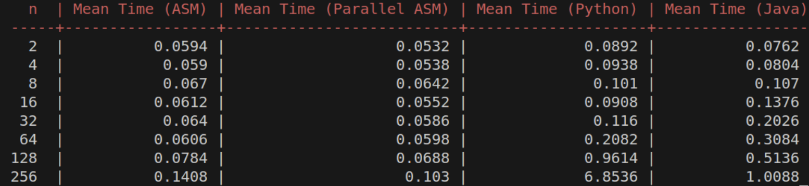
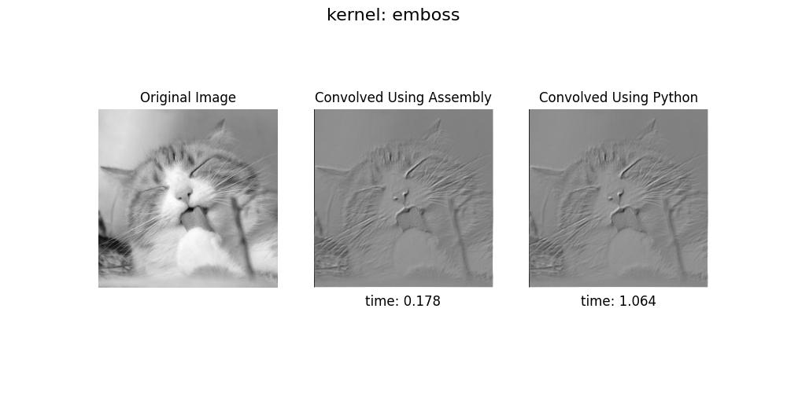
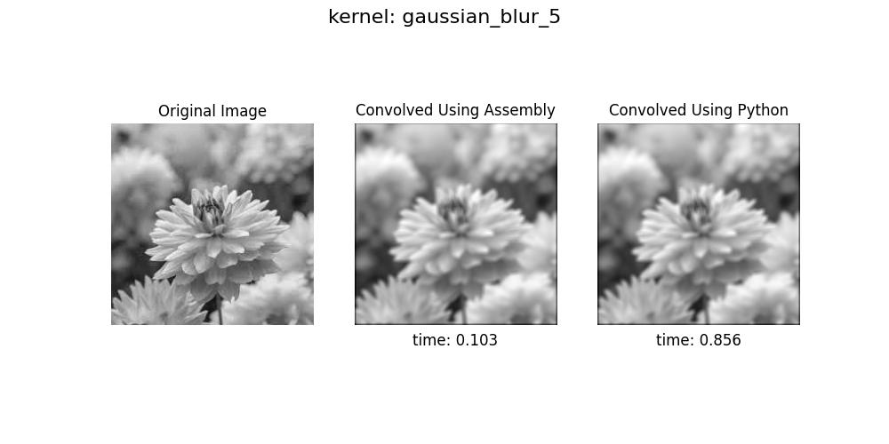

# Assembly-Optimized Image Processing and Matrix Multiplication

This project showcases how using Assembly language can significantly reduce the execution time of computationally heavy tasks. I implemented and benchmarked two major algorithms—2D convolution and matrix multiplication—across different languages (Assembly, Python, Java) to highlight performance improvements.


## What I Did

* **2D Convolution**: Wrote a custom implementation of image convolution in Assembly and compared its execution time to a Python implementation. The goal was to demonstrate how low-level memory control and elimination of interpreter overhead speed up pixel-based operations.

* **Matrix Multiplication**: Implemented both serial and parallel versions of matrix multiplication in Assembly. For comparison, I also implemented the same algorithm in Python and Java. The parallel Assembly version uses loop unrolling and manual register-level optimizations.

* **Performance Comparison**: Benchmarked the execution time of each implementation using timing scripts. Assembly versions showed significant speedup over Python (and to a lesser extent, Java), particularly for large matrices and images.

* **Visualization**: Sample input and output images were used to ensure correctness of convolution. Output matrices were compared across languages to confirm functional equivalence.


## Why I Did It

The main motivation behind this project was to explore:

* **Low-level performance tuning** using Assembly.
* **Language-level overhead** differences in executing the same logic.
* How much speed-up can be achieved through manual optimization and memory control.

Absolutely! Here’s a neat **Project Structure** section you can add to your README to give an overview of your files and folders:


## Project Structure

```
2D Convolution/          # Assembly and Python code plus scripts for 2D image convolution and benchmarking
Matrix Multiplication/   # Assembly, Python, and Java implementations of matrix multiplication with testing scripts
Images/                  # Sample input images for convolution tests
Outputs/                 # Generated output images after applying filters
Other files              # Helper assembly files, C drivers, and utility scripts used in the project

```

## Output Previews

### Matrix Multiplication


The benchmark shows that parallel Assembly significantly outperforms other implementations in matrix multiplication, with up to 50× speed-up over Python and noticeable gains over Java. Even at small sizes, Assembly versions are faster, and the gap widens as matrix size increases. 

### 2D convolution 




These two examples demonstrate the efficiency of the Assembly implementation for 2D convolution compared to Python. The emboss filter applied to the cat image ran in 0.178 seconds using Assembly, significantly faster than Python’s 1.064 seconds. Similarly, the Gaussian blur (kernel size 5) on the flower image completed in 0.103 seconds with Assembly, compared to 0.856 seconds in Python. These results clearly show that Assembly provides substantial speed improvements for image processing tasks while producing visually consistent outputs.

## Takeaway

By implementing computationally intensive algorithms in Assembly, I was able to demonstrate not only correctness but also substantial performance gains. This exercise gave me hands-on insight into how systems-level programming can be used for real-world optimization.
